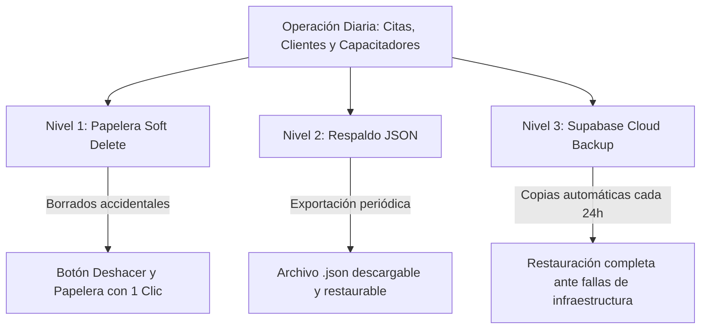

# 🛡️ Guía de Copias de Seguridad y Recuperación ante Desastres (Agenda-One)

Este documento detalla la arquitectura de copias de seguridad de **Agenda-One (Modelo AD-RE-11)** y los procedimientos paso a paso para proteger y restaurar la información operativa (citas, catálogo de 109 empresas clientes, capacitadores, firmas y bitácoras de auditoría).

---

## 📑 Índice
1. [Protección en Capas](#1-protección-en-capas)
2. [Nivel 1: Papelera de Citas y Botón "Deshacer" (Recuperación Instantánea)](#2-nivel-1-papelera-de-citas-y-botón-deshacer)
3. [Nivel 2: Copia de Seguridad Local en JSON (Descarga en 1 Clic)](#3-nivel-2-copia-de-seguridad-local-en-json)
4. [Nivel 3: Backups Automáticos en la Nube de Supabase (PostgreSQL)](#4-nivel-3-backups-automáticos-en-la-nube-de-supabase)
5. [Procedimiento de Restauración desde el Panel de Supabase](#5-procedimiento-de-restauración-desde-el-panel-de-supabase)
6. [Resumen de Buenas Prácticas para la Coordinación](#6-resumen-de-buenas-prácticas-para-la-coordinación)

---

## 1. Protección en Capas

En entornos empresariales reales donde una sola persona se encarga de agendar y monitorear la operación, los accidentes más frecuentes son **borrados involuntarios** o **errores de digitación**.

Para evitar depender de restauraciones totales de base de datos (que revertirían todo el trabajo realizado en el día), Agenda-One cuenta con **3 niveles de seguridad redundante**:

---

## 2. Nivel 1: Papelera de Citas y Botón "Deshacer"

### ¿Cómo funciona?
Cuando la coordinadora presiona el botón **Eliminar Cita**:
1. La cita **no se destruye físicamente** de la base de datos PostgreSQL.
2. Se marca con una marca de tiempo en la columna `deleted_at` (**Soft Delete**).
3. Aparece una notificación flotante en pantalla con un botón destacado:
   > `[Cita movida a la papelera con éxito] -> [DESHACER]`
4. Al hacer clic en **Deshacer**, la cita se recupera al instante en el calendario activo.

### Acceso a la Papelera Completa:
- En la barra superior de navegación, haz clic en el botón **Papelera** (ícono de cesto ámbar).
- Verás el listado de todas las citas eliminadas con fecha, hora, cliente y capacitador.
- Haz clic en **Restaurar Cita** en cualquiera de ellas para devolverla inmediatamente a la cuadrícula.

---

## 3. Nivel 2: Copia de Seguridad Local en JSON

### ¿Cómo descargar un respaldo completo?
1. En la cabecera de la aplicación, haz clic en el botón **Respaldos** (o abre el buscador con `Ctrl + K` y escribe `Respaldos`).
2. En la pestaña **Descargar Respaldo**, presiona el botón **Descargar Copia de Seguridad**.
3. El navegador descargará un archivo estructurado con nombre:
   `backup_agenda_one_YYYY-MM-DD.json`
4. Este archivo contiene el 100% de los datos:
   - Catálogo de clientes (109 empresas con contactos y correos).
   - Catálogo de capacitadores (iniciales, tarifas, colores, pines cifrados).
   - Todas las citas (activas e históricas con firmas digitales).
   - Registros de auditoría (quién y cuándo creó o modificó cada cita).

### ¿Cómo restaurar un archivo JSON?
1. En el mismo modal de **Respaldos**, selecciona la pestaña **Restaurar Archivo**.
2. Selecciona tu archivo `backup_agenda_one_*.json`.
3. Revisa la vista previa de citas y clientes a sincronizar.
4. Presiona **Confirmar y Restaurar Datos**. La base de datos sincronizará e insertará los registros de forma segura.

---

## 4. Nivel 3: Backups Automáticos en la Nube de Supabase

Supabase (el proveedor cloud de PostgreSQL de Agenda-One) realiza copias de seguridad automatizadas del clúster de base de datos:

| Característica | Detalle |
| :--- | :--- |
| **Frecuencia** | Cada 24 horas automáticamente (en la madrugada sin interrupción de servicio). |
| **Ubicación** | Almacenamiento distribuido y redundante en la nube de AWS. |
| **Integridad** | Copias de seguridad a nivel de bloque y snapshot de disco de PostgreSQL. |
| **Intervención humana** | Cero. No requiere que la coordinadora ejecute comandos ni scripts. |

---

## 5. Procedimiento de Restauración desde el Panel de Supabase

En caso de contingencia mayor (por ejemplo, pérdida total de acceso o corrupción crítica):

1. **Ingreso al Panel**:
   - Navega a [https://supabase.com/dashboard](https://supabase.com/dashboard) e inicia sesión con las credenciales de la empresa.
2. **Selección del Proyecto**:
   - Haz clic en el proyecto **Agenda-One**.
3. **Navegar a Backups**:
   - En la barra lateral izquierda, selecciona el ícono de **Database** (Base de Datos) y luego haz clic en **Backups**.
4. **Elegir Punto de Restauración**:
   - En la sección **Scheduled Backups** (Respaldos Programados), verás la lista de copias de los días anteriores con su fecha y hora UTC.
5. **Ejecutar Restauración**:
   - Haz clic en el botón **Restore** al lado del respaldo del día que deseas recuperar.
   - Confirma la acción en el cuadro de diálogo.
   - En un lapso de 1 a 3 minutos, tu base de datos volverá exactamente al estado en que se encontraba en ese momento.

---

## 6. Resumen de Buenas Prácticas para la Coordinación

1. **Uso habitual del botón Deshacer**: Si borraste una cita por equivocación al hacer clic rápido, no te alarmes; simplemente pulsa **Deshacer** en la alerta inferior o ábrela desde el botón **Papelera**.
2. **Descarga de respaldo mensual**: Al finalizar el cierre de mes o previo a una migración masiva de citas por Excel, descarga una copia JSON desde **Respaldos** y guárdala en una carpeta de respaldo en la computadora o Google Drive.
3. **Sesión de 30 Días**: La sesión del PIN de administrador se mantiene abierta durante 30 días continuos en tu navegador, por lo que no necesitas ingresar el PIN cada vez que abres o cierras la pestaña.
